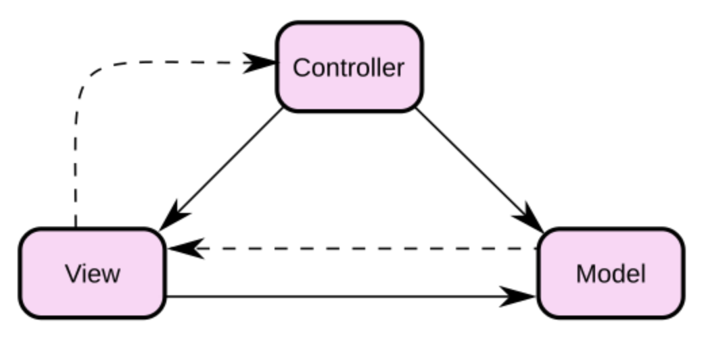
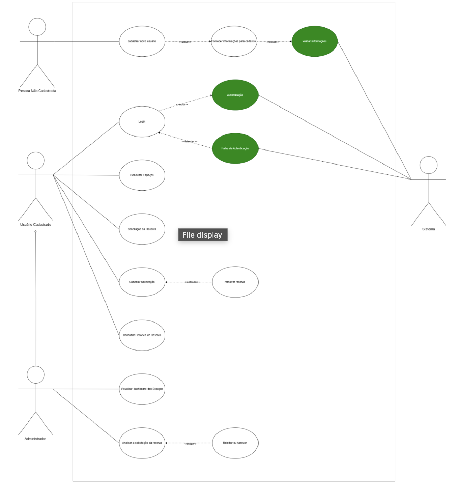
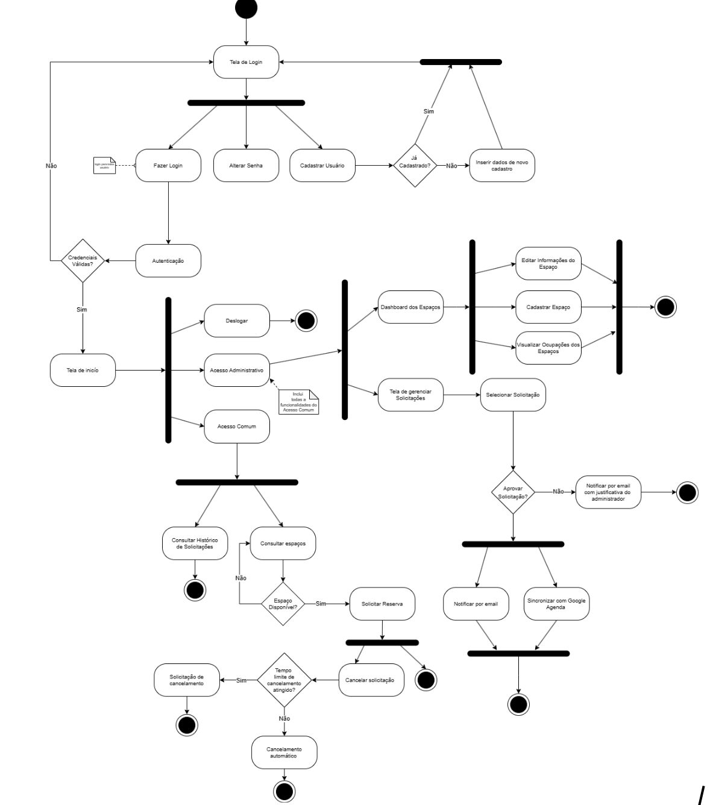
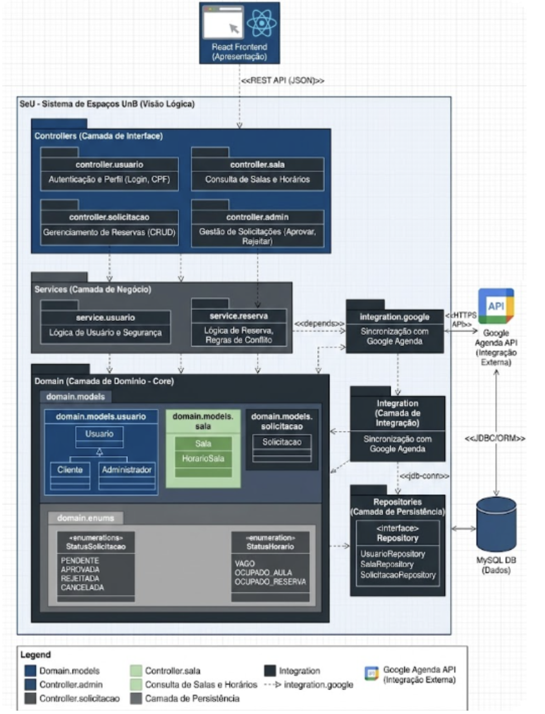
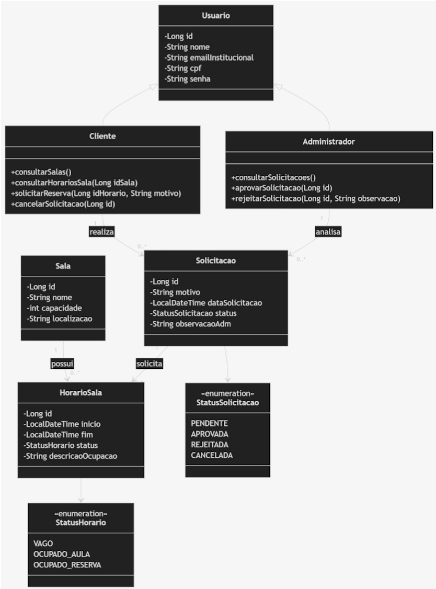
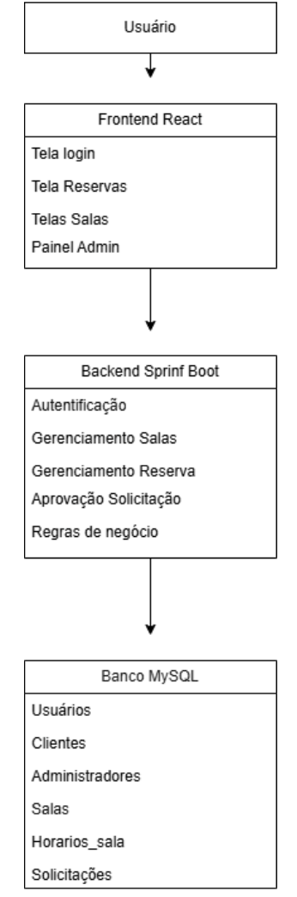
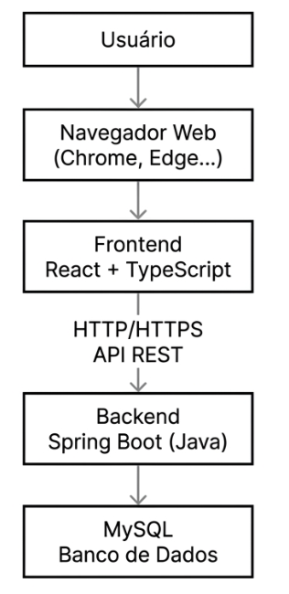

# 2. Representação Arquitetural
 
## 2.1 Definições
 
O sistema "Seu Espaço UnB" adotará o padrão arquitetural MVC (Model-View-Controller). Esta abordagem consolida-se na separação estrita das responsabilidades da aplicação em três camadas distintas, porém altamente interconectadas, promovendo a modularidade, o encapsulamento e a organização semântica do código. No contexto de aplicações web modernas, a arquitetura MVC do projeto será implementada fisicamente através de um modelo Cliente-Servidor (Frontend desacoplado do Backend). O detalhamento das camadas instanciadas para este projeto engloba:
 
- **Model (Modelo / Lógica da Aplicação):** Representa o núcleo de dados, o estado do sistema e a lógica de negócios da aplicação. No escopo do projeto, será materializada utilizando o ecossistema Java Spring Boot em conjunto com o banco de dados MySQL para o armazenamento das informações. Esta camada é responsável por definir como os dados (como Espaços, Reservas e Perfis de Usuário) são estruturados e garante que as regras de uso dos espaços sejam respeitadas durante qualquer operação de reserva ou consulta e garantir a consistência, segurança e persistência das transações.

- **View (Visão / Camada de Apresentação):** É a saída de representação gráfica e o ponto de interação direta com os usuários. Será desenvolvida utilizando a biblioteca React e a linguagem tipada TypeScript, focando na construção de uma experiência fluida e responsiva. A View tem como responsabilidade consumir os dados providos pelo Model e exibi-los de forma reativa e intuitiva, respeitando os requisitos não-funcionais de usabilidade e a identidade visual modernista brasileira estabelecida para a marca ("SeU").

- **Controller (Controlador):** Atua como o intermediário e coordenação entre a interface e o núcleo de dados, entre as ações geradas na View e as operações processadas pelo Model. Na implementação do projeto, assumirá a forma de Controllers RESTful dentro do Spring Boot. Os Controladores receberão as requisições HTTP do frontend (como solicitações de reserva ou aplicação de filtros de busca), irão interpretar os parâmetros e delegar o processamento à camada Model e, por fim, retornarão respostas padronizadas (formato JSON) indicando sucesso ou erro da operação para a interface.

## 2.2 Justifique sua escolha
 
A adoção da estrutura arquitetural MVC, concretizado através da divisão técnica entre um frontend reativo e um backend RESTful, justifica-se por uma série de fatores estratégicos e técnicos diretamente alinhados aos documentos de Visão do Produto e Declaração de Escopo:
 
- **Familiaridade Técnica da Equipe:** Um dos motivos centrais para a escolha desta arquitetura foi a experiência prévia dos integrantes do grupo com o padrão MVC. A equipe já aplicou este modelo em disciplinas anteriores e em projetos de desenvolvimento pessoal, o que reduz o tempo de adaptação e aumenta a segurança na implementação das funcionalidades.

- **Desenvolvimento Paralelo, Alta Manutenibilidade e Escalabilidade de Escopo:** A divisão clara de responsabilidades permite que os subgrupos de frontend e backend trabalhem simultaneamente. O produto prevê uma evolução de complexidade, partindo de cadastros e listagens até atingir funcionalidades integradas. O isolamento promovido pelo MVC garante que a lógica de negócios (Model) possa sofrer manutenções profundas ou ampliações estruturais sem causar quebras em cascata na interface do usuário (View).

- **Reutilização de Componentes e Independência da Interface:** Ao projetar o controlador para fornecer dados de forma isolada, a lógica de negócios torna-se independente da plataforma de visualização. Caso a unidade acadêmica demande, no futuro, a criação de um aplicativo nativo para Android/iOS, o backend concebido nesta arquitetura poderá ser reaproveitado.

- **Integração Eficiente com as Tecnologias:** O framework Java Spring Boot foi concebido para operar nativamente com o padrão MVC. Optar pelo MVC permite que a equipe explore o potencial máximo do framework de forma fluida, utilizando os recursos internos do framework de maneira natural, facilitando a organização automática do código e a aplicação dos testes de software, reduzindo drasticamente a probabilidade de falhas de arquitetura e facilita a aplicação dos testes e garantindo a qualidade do produto final.

## 2.3 Detalhamento
 
**Camada de Modelo / Lógica da aplicação (Model):** Consiste na parte lógica. Ou seja, comportamento dos dados por meio das regras de negócios. Fica esperando as chamadas das funções (que permite o acesso aos dados que serão coletados, gravados e exibidos). Modela os dados e o comportamento por trás do processo de negócio.
 
**Camada de Apresentação (View):** Saída de representação dos dados, onde os dados solicitados do model são exibidos. A view deve garantir a visualização atualizada da Model. Mudanças na Model refletem na View.
 
**Camada de Controle (Controller):** Tem como foco a ação do usuário, é onde ocorre o recebimento de eventos da View, a manipulação dos dados e a chamada da Model para execução da lógica de negócio correspondente. Atua fortemente na organização do fluxo da aplicação.
 
Figura 1 - Esquemático da arquitetura MVC

Fonte: Wikipedia, Acesso em 2026.
 
Conforme a figura esquemática apresentada, o sistema é dividido em três componentes principais interconectados. Desse modo, a arquitetura MVC é categorizada pela separação de propósitos (Acesso aos dados, lógica de negócio, Lógica de Apresentação e interação com utilizador). O MVC ajuda na escalabilidade e o código com um propósito melhor definido (facilitando teste e desenvolvimento/reutilização).
 
## 2.4 Metas e restrições arquiteturais
 
Esta seção cumpre o papel fundamental de delimitar o campo de atuação da equipe de desenvolvimento, descrevendo detalhadamente os requisitos de alta prioridade que exercem influência direta e mandatória sobre as decisões de arquitetura do sistema. O objetivo é estabelecer um equilíbrio técnico entre as metas de qualidade, os objetivos de excelência que o software busca alcançar para satisfazer seus usuários e as restrições, as limitações técnicas, legais ou institucionais, assegurando que a arquitetura proposta seja não apenas funcional, mas também resiliente e adequada ao ambiente acadêmico da FCTE.
 
### 2.4.1 Metas Arquiteturais
 
As metas arquiteturais representam as prioridades de qualidade e os atributos de sistema que guiarão cada etapa da construção do software. Elas servem como bússola para a escolha de padrões de projeto e tecnologias, garantindo que o produto final não apenas cumpra suas tarefas básicas, mas as execute com um nível de excelência que atenda às expectativas da comunidade da FCTE:
 
- **Usabilidade e Experiência do Usuário (UX):** A meta central é converter a complexidade da gestão de espaços físicos em uma interface intuitiva, a fim de evitar os problemas atuais presentes que os funcionários enfrentam. O sistema deve permitir que um usuário realize a consulta de disponibilidade em poucos passos, utilizando elementos da identidade visual modernista brasileira para criar uma interface que transmita clareza, pertencimento e eficiência estética.

- **Desempenho e Eficiência:** O sistema deve garantir tempos de resposta baixos para operações de busca e filtragem de salas. A arquitetura deve ser otimizada para que o processamento no Backend e a persistência de dados no MYSQL ocorram de forma síncrona e ágil, garantindo que o usuário receba o retorno de suas buscas e filtros quase instantaneamente.

- **Segurança e Integridade dos Dados:** Como o sistema lida com dados de identificação (e-mail, CPF e senhas), a arquitetura deve priorizar a proteção dessas informações. A arquitetura deve garantir que apenas usuários autenticados acessem funcionalidades de reserva e que somente perfis administrativos possam alterar a grade de horários, mantendo um registro auditável e íntegro de todas as transações de dados.

- **Manutenibilidade:** Devido à natureza acadêmica do projeto, o código deve ser organizado de forma que futuros desenvolvedores possam compreender e evoluir o sistema facilmente. A separação clara proporcionada pelo padrão MVC é a meta estratégica para garantir que a lógica de dados e a interface possam ser atualizadas de forma independente.

- **Portabilidade:** O sistema deve ser acessível a partir de qualquer navegador moderno (Chrome, Firefox, Safari, Edge), garantindo que alunos e professores possam consultar os espaços tanto em computadores de mesa quanto em dispositivos móveis sem perda de funcionalidade.

### 2.4.2 Restrições Arquiteturais
 
As restrições são os fatores limitantes e as condições de contorno que a equipe deve respeitar obrigatoriamente durante todo o ciclo de vida do projeto. Elas representam decisões prévias ou condições externas que moldam e restringem as opções arquiteturais disponíveis:
 
- **Restrição Tecnológica:** O desenvolvimento está estritamente vinculado ao ecossistema tecnológico previamente validado pela equipe. Isso implica na utilização mandatória de React com TypeScript para a construção de um Frontend reativo e tipado, Java com Spring Boot para um Backend robusto e escalável, e MYSQL como motor de banco de dados relacional. Essa escolha visa aproveitar a familiaridade técnica do grupo e a estabilidade comprovada dessas ferramentas no mercado.
- **Conformidade com a LGPD (Lei Geral de Proteção de Dados):** O sistema deve ser projetado em total conformidade com a Lei Geral de Proteção de Dados (LGPD), garantindo o tratamento ético e seguro das informações pessoais coletadas durante o cadastro.
- **Padrões Visuais Institucionais:** A interface não é apenas uma ferramenta funcional, mas um ponto de contato institucional. Por isso, deve respeitar os padrões de design inspirados na identidade visual da UnB e na obra modernista de Athos Bulcão. Essa restrição impõe o uso de geometrias e paletas de cores que integrem o sistema visualmente ao ecossistema físico e cultural da universidade, validando-o como uma ferramenta oficial.
- **Prazo de Entrega:** O projeto possui uma restrição temporal rígida vinculada ao calendário do semestre letivo. Essa limitação impõe um planejamento rigoroso de Sprints semanais, onde a priorização deve ser constantemente avaliada para garantir que o MVP (Mínimo Produto Viável) seja entregue com todas as funcionalidades críticas até o final do cronograma acadêmico.
- **Infraestrutura de Rede e Conectividade do Campus:** O sistema deve operar de forma eficiente considerando as condições de conectividade do campus. Portanto, as requisições entre o Cliente (Frontend) e o Servidor (Backend) devem ser projetadas para serem extremamente leves, garantindo que o sistema permaneça funcional e rápido.
## 2.5 Visões
 
### 2.5.1 Visão de uso
 
Para uma melhor visualização do sistema, apresentamos o Diagrama de Caso de Uso (figura 2), no qual os atores do sistema exemplificam as funcionalidades acessíveis a cada perfil. Nele, destacam-se o fluxo de autenticação, onde o logar e cadastrar novo usuário possuem dependências de inclusão, para autenticação e validação, os quais estão destacados em verde. Na ação do ator primário ele herda as capacidades do usuário cadastrado, complementando-as com ações de gestão, como Visualização de Dashboard e Análise de Solicitação. Enquanto a ação do ator secundário, o ator Sistema está posicionado à direita para evidenciar sua responsabilidade no processamento de validações automáticas, como o envio de notificações e a verificação de credenciais, funcionando como o motor que suporta as ações dos usuários.
 
Figura 2 - Diagrama de Casos de Uso

 
Fonte: Elaborado pelos autores (2026).
 
Deste forma, em virtude de uma melhor visualização da complexidade do sistema e proporcionar uma melhor interpretação do funcionamento do fluxo de execução das atividades, utilizou-se também o Diagrama de Atividades (Figura 3). Esse diagrama representa a sequência das ações realizadas pelos usuários e pelo sistema, evidenciando processos como autenticação, gerenciamento de solicitações, reserva de espaços, notificações automáticas e cancelamentos. Dessa forma, torna-se possível compreender de maneira mais clara e concisa a dinâmica operacional do sistema e a interação entre seus componentes.
 
Figura 3 - Diagrama de Atividades

 
Fonte: Elaborado pelos autores (2026).
 
### 2.5.2 Visão de organização lógica
 
A organização lógica do sistema Seu Espaço UnB (SeU) é estruturada para atender à necessidade de gerenciamento de espaços físicos da FCTE, separando as funcionalidades de acordo com os perfis de usuário e os objetivos de negócio identificados na visão do produto. O sistema utiliza o padrão MVC (Model-View-Controller) para organizar a interação entre a interface e o processamento de dados.
 
**A. Decomposição Funcional (Módulos)**
 
A lógica do sistema é organizada em quatro grandes frentes, conforme as funcionalidades elicitadas:
 
- **Gerenciamento de Perfil:** Responsável pela identificação dos usuários e pela lógica de diferenciação entre o perfil de Usuário (comum) e Administrador.
- **Consulta de Espaços:** Implementa a lógica de busca e visualização das salas e laboratórios, permitindo filtrar os locais por características específicas da unidade.
- **Sistema de Reservas:** Módulo central que processa as solicitações de uso, gerencia os status de aprovação/rejeição e garante a sincronização com o calendário.
- **Integração com Google Agenda:** Responsável pela comunicação externa para que as reservas aprovadas sejam refletidas automaticamente na agenda institucional.
**B. Camadas de Organização**
 
A organização lógica segue a divisão de responsabilidades definida na arquitetura do projeto:
 
- **Comunicação Frontend-Backend:** Realizada através de APIs RESTful. A camada de Visão (React) envia requisições via protocolo HTTP/HTTPS e recebe respostas em formato JSON.
- **Interface Controladora (Controller):** Atua como o ponto de entrada das requisições, delegando o processamento à camada de Modelo e retornando o status da operação (sucesso ou erro) para o usuário.
- **Interface de Persistência:** A camada de Modelo comunica-se com o banco de dados MySQL para garantir a consistência das transações de reserva e o armazenamento seguro dos perfis.
**C. Fluxo Lógico de Dados**
 
A lógica de operação segue um fluxo unidirecional para garantir a manutenção:
 
1. A interface solicita uma ação (ex: reserva de sala).
2. O componente de controle valida se o usuário possui o perfil adequado (Usuário ou Admin).
3. O modelo processa a solicitação e atualiza o banco de dados.
4. O status é retornado à interface e, em caso de sucesso, replicado para o Google Agenda.

Figura 4 - Diagrama de Pacote
 

Fonte: Elaborado pelos autores (2026).
 
### 2.5.3 Visão estrutural

A visão estrutural do sistema Seu Espaço UnB (SeU) apresenta os principais elementos que compõem a aplicação, como eles se conectam e suas responsabilidades dentro do processo de gerenciamento de reservas de espaços acadêmicos da FCTE.

O sistema é composto pelos elementos principais:

* Usuário;
* Sala;
* Horário da Sala;
* Solicitação de Reserva.

Os usuários do sistema são representados por uma única entidade, Usuario, diferenciada por um atributo de perfil (TipoUsuario, com os valores CLIENTE e ADM) em vez de subclasses distintas. Essa decisão simplifica a persistência dos dados e a lógica de autenticação, já que o Spring Security atribui os papéis de acesso (ROLE_CLIENTE, ROLE_ADM) diretamente a partir desse atributo, sem necessidade de herança entre classes. O perfil Cliente é responsável por consultar salas, verificar disponibilidade e realizar solicitações de reserva. O perfil Administrador possui permissões para analisar, aprovar ou rejeitar solicitações e gerenciar a ocupação dos espaços.

A entidade Sala representa os espaços físicos disponíveis para uso acadêmico, enquanto HorarioSala define a grade de horários de cada ambiente: cada registro corresponde a um dia da semana fixo, com hora de início e fim. A ocupação por aulas regulares é indicada pelo campo descricaoOcupacao, enquanto a disponibilidade para reservas pontuais é controlada pela relação com a entidade Solicitacao. A entidade Solicitacao registra as reservas realizadas pelos usuários, armazenando motivo, quantidade de participantes, data de uso, status e, quando aplicável, a observação do administrador responsável pela análise.

Os elementos do sistema se conectam por meio de relacionamentos que representam o fluxo de funcionamento da aplicação:

* um usuário pode realizar várias solicitações;
* cada solicitação pertence a um horário específico (HorarioSala);
* uma sala pode possuir vários horários cadastrados;
* ao aprovar uma solicitação, o sistema rejeita automaticamente as demais solicitações pendentes que concorriam pelo mesmo horário e data.

Figura 5 - Diagrama de Classes
 

Fonte: Elaborado pelos autores (2026).
 
O sistema foi estruturado em arquitetura de três camadas, composta por frontend, backend e banco de dados.
 
Figura 6 - Diagrama de Componentes

 
Fonte: Elaborado pelos autores (2026).
 
A estrutura do sistema foi organizada de forma modular, separando interface, regras de negócio e persistência de dados. Essa divisão permite maior facilidade de manutenção, escalabilidade e reutilização dos componentes da aplicação.
 
A utilização de uma arquitetura em camadas, juntamente com a modelagem orientada a objetos apresentada no diagrama de classes, contribui para um sistema mais organizado, seguro e alinhado aos requisitos funcionais definidos para o projeto Seu Espaço UnB (SeU).
 
## 2.6 Visão de Implantação
 
O sistema Seu Espaço UnB será implantado em uma arquitetura cliente-servidor, permitindo o acesso dos usuários por meio de navegadores web modernos em computadores e dispositivos móveis.
 
A camada de apresentação será desenvolvida utilizando React com TypeScript, sendo executada no navegador do usuário. Essa camada será responsável pela interface gráfica, interação com o usuário e envio das requisições para o backend.
 
A camada de negócio será implementada utilizando Java com Spring Boot, funcionando como servidor da aplicação e responsável pelo processamento das regras de negócio, autenticação, gerenciamento de reservas e comunicação com o banco de dados.
 
O banco de dados utilizado será o MySQL, responsável pelo armazenamento persistente das informações do sistema, como usuários, espaços físicos, reservas e históricos.
 
A comunicação entre frontend e backend ocorre por meio de APIs REST utilizando protocolo HTTP/HTTPS e troca de dados no formato JSON.
 
A arquitetura foi escolhida por proporcionar:
 
- Separação de responsabilidades;
- Facilidade de manutenção;
- Escalabilidade;
- Melhor organização do desenvolvimento;
- Possibilidade de acesso remoto pela comunidade acadêmica.
Figura 7 - Diagrama de Implantação da Aplicação
 

Fonte: Elaborado pelos autores (2026).
 
## 2.7 Restrições adicionais
 
O sistema Seu Espaço UnB (SeU) é uma aplicação web acessível diretamente pela internet, exigindo autenticação prévia por meio de e-mail institucional, CPF e senha.
 
O sistema deve suportar múltiplos usuários logados simultaneamente, considerando que a FCTE conta com 3.016 alunos regulares de graduação (dados do 2º semestre de 2024), além dos docentes e funcionários técnicos-administrativos que terão perfil de Administrador no sistema, conforme o Anuário da UnB 2025 (Tabela 2.16).
 
No que diz respeito às características de qualidade de software, destacam-se:
 
- **Usabilidade:** a interface deve ser intuitiva e de fácil navegação, permitindo que usuários sem conhecimento técnico realizem reservas e consultas sem dificuldades;
- **Eficiência:** o sistema deve apresentar tempo de resposta inferior a 2 segundos para as principais operações, como listagem e filtragem de espaços;
- **Confiabilidade:** a aplicação deve garantir estabilidade nas funcionalidades entregues, assegurada pela Definition of Done da equipe, que exige testes aprovados e revisão de código antes de qualquer integração à branch principal;
- **Portabilidade:** por ser uma aplicação web, o sistema deve funcionar nos principais navegadores modernos sem necessidade de instalação;
- **Segurança:** o sistema lida com dados pessoais dos usuários, como CPF, e-mail e senha, devendo garantir criptografia de senhas e proteção contra acessos não autorizados;
Em relação à segurança e aos perfis de acesso, o sistema adota uma hierarquia de classes na qual tanto o perfil Cliente quanto o perfil Administrador herdam da classe base Usuario, responsável por centralizar os atributos comuns de identificação, como `id`, `nome`, `emailInstitucional`, `cpf` e `senha`.
 
Essa decisão arquitetural evita duplicação de dados e centraliza a lógica de autenticação em um único ponto.
 
A diferenciação de permissões ocorre por meio da especialização da classe base:
 
- O perfil **Cliente** possui acesso às operações de consulta e solicitação, podendo consultar salas, visualizar horários disponíveis, solicitar reservas e cancelar solicitações;
- O perfil **Administrador** possui permissões de gestão, sendo responsável por consultar solicitações pendentes, aprovar reservas e rejeitar solicitações com observações, além de ser o único perfil capaz de alterar o estado de uma solicitação.