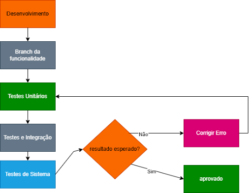

# 6. Testes de Software
 
## 6.1 Estratégia de Testes
 
Para a validação do sistema usaremos testes unitários, que serão utilizados para verificação imediata de cada parte nova do código. Testes de integração, que determinam se as funcionalidades estão sendo executadas de forma integrada. Além de serem feitos testes de sistema, que vão garantir que as funcionalidades seguem os requisitos. Além da utilização de testes funcionais para termos feedbacks do funcionamento das funcionalidades que terão no sistema e não funcionais que serão aplicados principalmente em requisitos de desempenho, segurança e usabilidade do sistema.
 
Todo o desenvolvimento ocorrerá de forma integrada ao Github, onde cada requisito do projeto, como cadastro, consulta de espaço, reserva, cancelamento, etc, terá sua própria branch para testes locais antes da junção com a branch main, além de termos branches para a documentação e para informação do projeto, que facilitará a visualização da evolução do sistema e organização. Além disso, em primeiro momento para os testes automatizados será utilizado o Github Actions.
 
Para a análise dos testes, será feita a validação no sistema por meio da comparação entre o que se espera e o resultado, e qualquer divergência será registrada como um defeito, corrigida e testada novamente, até que obtenhamos uma versão estável.

Figura 6 - Diagrama do Processo de Desenvolvimento

Fonte: Elaborado pelo grupo

 
## 6.2 Roteiro de Teste
 
O roteiro de testes consiste no planejamento dos casos de testes que serão executados ao longo do desenvolvimento do sistema Seu Espaço UnB, com o objetivo de validar as funcionalidades definidas no backlog do produto e garantir a qualidade da aplicação.
 
O roteiro deve conter:
- Código de identificação do teste
- Nome do teste
- Objetivo do teste
- Nível do teste (unitário, integrado, sistema)
- Tipo de teste (funcional, não funcional — se não funcional, especificar tipo: usabilidade, portabilidade, etc.)
- Precondições para o teste ser realizado
- Definição de Aceito/Rejeitado dos testes propostos (resultados esperados para o teste ser aceito como OK)
- Espaço para registro dos resultados do teste (com evidências objetivas)
- Reparos executados
- Quantidade de ciclos de testes executados para cada caso de teste proposto
Quadro x - Roteiro de Testes do Sistema Seu Espaço UnB
 
| ID | Nome do Teste | Objetivo do Teste | Nível | Tipo | Pré-condições | Critério de Aceite | Resultado | Evidências | Reparos | Ciclos |
|---|---|---|---|---|---|---|---|---|---|---|
| CT-01 | Cadastro de usuário | Verificar cadastro | Sistema | Funcional | Usuário não cadastrado | Cadastro realizado | A ser executado | — | — | — |
| CT-02 | Login válido | Validar login correto | Sistema | Funcional | Usuário cadastrado | Acesso permitido | A ser executado | — | — | — |
| CT-03 | Login inválido | Validar erro no login | Sistema | Funcional | Usuário cadastrado | Mensagem de erro | A ser executado | — | — | — |
| CT-04 | Validação de login | Validar função de autenticação | Unitário | Funcional | Dados válidos | Retorna sucesso | A ser executado | — | — | — |
| CT-05 | Consulta de espaços | Verificar listagem | Integração | Funcional | Usuário logado | Lista exibida | A ser executado | — | — | — |
| CT-06 | Verificar disponibilidade | Validar horários disponíveis | Unitário | Funcional | Horários definidos | Retorna disponibilidade correta | A ser executado | — | — | — |
| CT-07 | Filtro de espaços | Validar filtro | Integração | Funcional | Lista disponível | Filtro correto | A ser executado | — | — | — |
| CT-08 | Detalhes da sala | Verificar detalhes | Sistema | Funcional | Sala selecionada | Detalhes exibidos | A ser executado | — | — | — |
| CT-09 | Solicitação de reserva | Criar reserva | Sistema | Funcional | Usuário logado | Reserva criada | A ser executado | — | — | — |
| CT-10 | Criação de reserva | Validar função de criação | Unitário | Funcional | Dados válidos | Reserva criada corretamente | A ser executado | — | — | — |
| CT-11 | Cancelar reserva | Cancelar reserva | Sistema | Funcional | Reserva existente | Reserva cancelada | A ser executado | — | — | — |
| CT-12 | Aprovar reserva | Aprovar reserva | Sistema | Funcional | Reserva pendente | Reserva aprovada | A ser executado | — | — | — |
| CT-13 | Rejeitar reserva | Rejeitar reserva | Sistema | Funcional | Reserva pendente | Reserva rejeitada | A ser executado | — | — | — |
| CT-14 | Desempenho de resposta | Tempo de resposta | Sistema | Não Funcional | Sistema ativo | < 2 segundos | A ser executado | — | — | — |
| CT-15 | Usabilidade | Facilidade de uso | Sistema | Não Funcional | Interface ativa | Uso intuitivo | A ser executado | — | — | — |