# 6. Testes de Software
 
## 6.1 Estratégia de Testes
 
Para a validação do sistema usaremos testes unitários, que serão utilizados para verificação imediata de cada parte nova do código. Testes de integração, que determinam se as funcionalidades estão sendo executadas de forma integrada. Além de serem feitos testes de sistema, que vão garantir que as funcionalidades seguem os requisitos. Além da utilização de testes funcionais para termos feedbacks do funcionamento das funcionalidades que terão no sistema e não funcionais que serão aplicados principalmente em requisitos de desempenho, segurança e usabilidade do sistema.
 
Todo o desenvolvimento ocorrerá de forma integrada ao Github, onde cada requisito do projeto, como cadastro, consulta de espaço, reserva, cancelamento, etc, terá sua própria branch para testes locais antes da junção com a branch main, além de termos branches para a documentação e para informação do projeto, que facilitará a visualização da evolução do sistema e organização. Além disso, em primeiro momento para os testes automatizados será utilizado o Github Actions.
 
Para a análise dos testes, será feita a validação no sistema por meio da comparação entre o que se espera e o resultado, e qualquer divergência será registrada como um defeito, corrigida e testada novamente, até que obtenhamos uma versão estável.

Figura 6 - Diagrama do Processo de Desenvolvimento

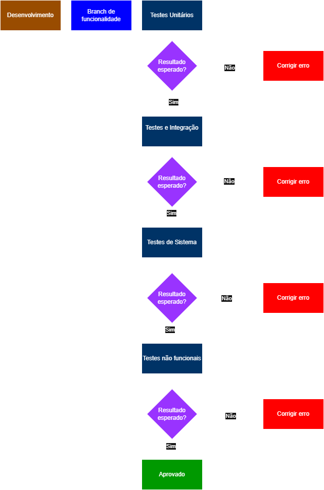

Fonte: Elaborado pelo grupo

 
## 6.2 Roteiro de Teste
 
O roteiro de testes consiste no planejamento dos casos de testes que serão executados ao longo do desenvolvimento do sistema Seu Espaço UnB, com o objetivo de validar as funcionalidades definidas no backlog do produto e garantir a qualidade da aplicação.
 
O roteiro deve conter:
- Código de identificação do teste
- Nome do teste
- Objetivo do teste
- Nível do teste (unitário, integrado, sistema)
- Tipo de teste (funcional, não funcional — se não funcional, especificar tipo: usabilidade, portabilidade, etc.)
- Precondições para o teste ser realizado
- Definição de Aceito/Rejeitado dos testes propostos (resultados esperados para o teste ser aceito como OK)
- Espaço para registro dos resultados do teste (com evidências objetivas)
- Reparos executados
- Quantidade de ciclos de testes executados para cada caso de teste proposto
Quadro x - Roteiro de Testes do Sistema Seu Espaço UnB
 
| ID | Nome do Teste | Objetivo do Teste | Nível | Tipo | Pré-condições | Critério de Aceite | Resultado | Evidências | Reparos | Ciclos |
|---|---|---|---|---|---|---|---|---|---|---|
| CT-01 | Cadastro de usuário | Verificar cadastro | Sistema | Funcional | Usuário não cadastrado | Cadastro realizado | Aprovado | 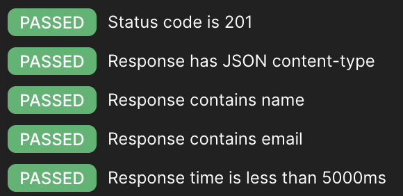  | Nenhum | 1 |
| CT-02 | Login válido | Validar login correto | Sistema | Funcional | Usuário cadastrado | Acesso permitido | Aprovado | 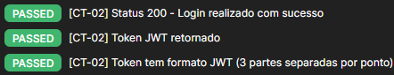 | Nenhum | 1 |
| CT-03 | Login inválido | Validar erro no login | Sistema | Funcional | Usuário cadastrado | Mensagem de erro | Aprovado | 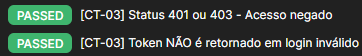 | Nenhum | 1 |
| CT-04 | Validação de login | Validar função de autenticação | Unitário | Funcional | Dados válidos | Retorna sucesso | Aprovado | 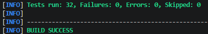 | Nenhum | 1 |
| CT-05 | Consulta de espaços | Verificar listagem | Integração | Funcional | Usuário logado | Lista exibida | Aprovado | 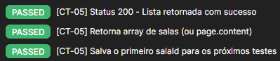 | Nenhum | 1 |
| CT-06 | Verificar disponibilidade | Validar horários disponíveis | Unitário | Funcional | Horários definidos | Retorna disponibilidade correta | Aprovado |  | Nenhum | 1 |
| CT-07 | Filtro de espaços | Validar filtro | Integração | Funcional | Lista disponível | Filtro correto | Aprovado | 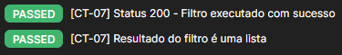 | Nenhum | 1 |
| CT-08 | Detalhes da sala | Verificar detalhes | Sistema | Funcional | Sala selecionada | Detalhes exibidos | Aprovado | 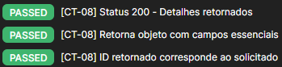 | Nenhum | 1 |
| CT-09 | Solicitação de reserva | Criar reserva | Sistema | Funcional | Usuário logado | Reserva criada | Aprovado | 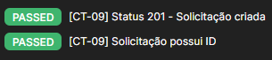 | Nenhum | 1 |
| CT-10 | Criação de reserva | Validar função de criação | Unitário | Funcional | Dados válidos | Reserva criada corretamente | Aprovado |  | Nenhum | 1 |
| CT-11 | Cancelar reserva | Cancelar reserva | Sistema | Funcional | Reserva existente | Reserva cancelada | Aprovado |  | Nenhum | 1 |
| CT-12 | Aprovar reserva | Aprovar reserva | Sistema | Funcional | Reserva pendente | Reserva aprovada | Aprovado | 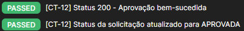 | Nenhum | 1 |
| CT-13 | Rejeitar reserva | Rejeitar reserva | Sistema | Funcional | Reserva pendente | Reserva rejeitada | Aprovado | 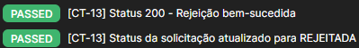 | Nenhum | 1 |
| CT-14 | Desempenho de resposta | Tempo de resposta | Sistema | Não Funcional | Sistema ativo | < 2 segundos | Aprovado | 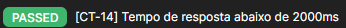 | Nenhum | 1 |
| CT-15 | Acessibilidade e Responsividade da Interface | Facilidade de uso | Sistema | Não Funcional | Interface ativa | Sistema responsivo em dispositivos móveis e fluxo de reserva concluído em no máximo 4 interações | Aprovado | 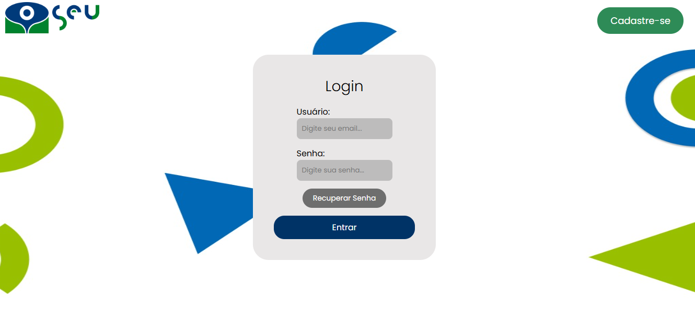 | Nenhum | 1 |
| CT-16 | Cadastro com email duplicado | Validar bloqueio de e-mail já existente | Integração | Funcional | Usuário já cadastrado no banco | Status 400 ou 409 | Aprovado | 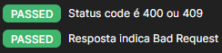 | Nenhum | 1 |
| CT-17 | Cadastro com CPF duplicado | Validar bloqueio de CPF já existente | Integração | Funcional | Usuário já cadastrado no banco | Status 400 ou 409 | Aprovado | 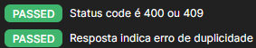 | Nenhum | 1 |
| CT-18 | Acesso sem token | Validar bloqueio de acesso sem autenticação | Integração | Funcional | Usuário não autenticado | Status 401 ou 403 | Aprovado | 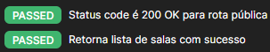 | Nenhum | 1 |
| CT-19 | Buscar sala inexistente | Garantir tratamento de erro para recurso não encontrado | Integração | Funcional | Usuário autenticado | Status 404 | Aprovado | 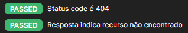 | Nenhum | 1 |
| CT-20 | Solicitação sem token | Validar bloqueio de criação de reserva sem autenticação | Integração | Funcional | Usuário não autenticado | Status 401 ou 403 | Aprovado | 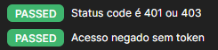 | Nenhum | 1 |
| CT-21 | Aprovação por perfil Aluno (RBAC) | Validar restrição de perfil para aprovação de solicitações | Integração | Funcional | Usuário autenticado com perfil Aluno | Status 403 | Aprovado | 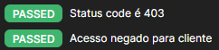 | Renovação do token no fluxo do teste | 1 |
| CT-22 | Fluxo Usuário — Cadastro a Cancelamento | Validar fluxo completo do usuário desde o cadastro até o cancelamento de reserva | Sistema | Funcional | API ativa e banco disponível | Todos os passos retornam sucesso (201, 200, 204) | Aprovado | 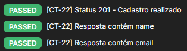 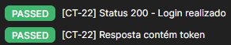 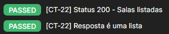 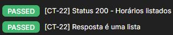 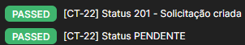 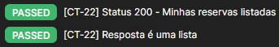  | Nenhum | 1 |
| CT-23 | Fluxo ADM — Aprovação e Rejeição Automática | Validar fluxo completo do ADM com aprovação e rejeição automática de concorrentes | Sistema | Funcional | Usuário ADM autenticado e duas solicitações pendentes para o mesmo horário | Solicitação aprovada com 200 e concorrente rejeitada automaticamente | Aprovado | 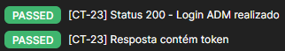 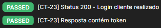 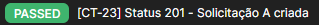  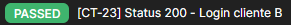 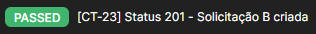 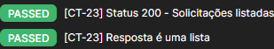 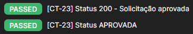 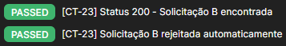 | Nenhum | 1 |
| CT-24 | Fluxo Google Agenda — Geração de URL | Validar geração de URL do Google Calendar após aprovação de solicitação | Sistema | Funcional | Solicitação aprovada existente | Status 200 e URL válida do Google Calendar retornada | Aprovado | 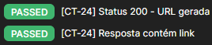 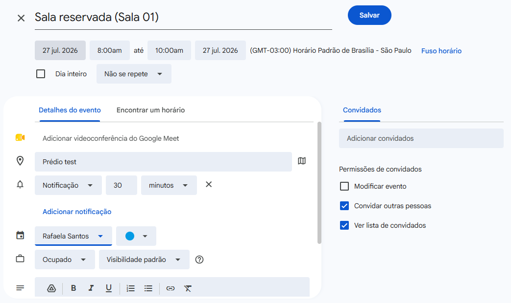 | Nenhum | 1 |

