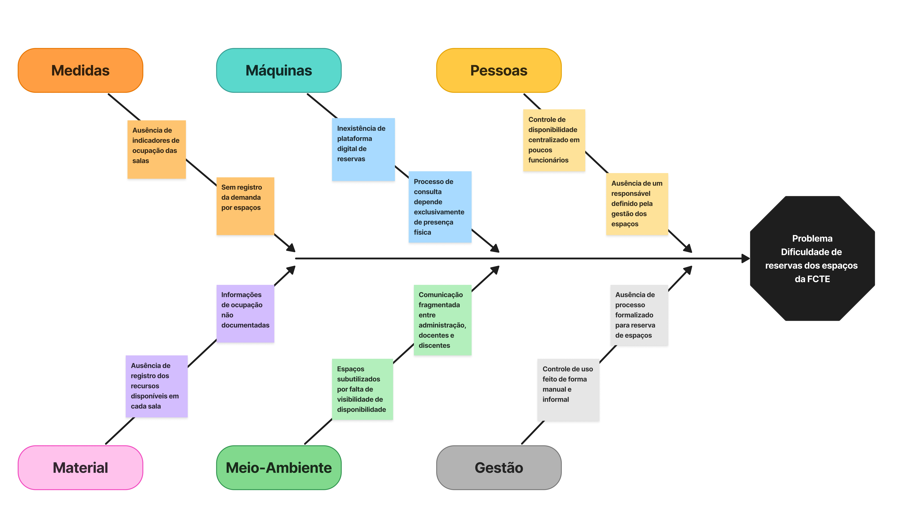
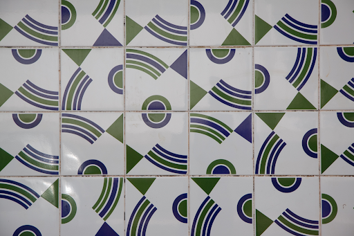

# 1. Visão geral do produto

# 1.1 Problema
- Em razão da comunidade acadêmica utilizar espaços acadêmicos para atividades de ensino, pesquisa e estensão distribuídas por salas de aula, laboratórios e auditórios, a verificação da disponibilidade dos espaços da FCTE é realizada por meio de processos ultrapassados, sem qualquer mecanismo digital de consulta ou agendamento. Essa ausência dos processos digitais inviabiliza o planejamento remoto e a reserva antecipada online dos espaços da FCTE, prejudicando toda a comunidade.

- Em decorrência disso, para uma melhor  análise e detecção do problema elaborou-se o Diagrama de Ishikawa, como observado na figura 1,  no qual identificaram-se fatores geradores e intensificadores na dificuldade de reservas de salas, laboratórios e auditórios. Observou-se, por exemplo, a informalidade no controle de acesso às salas, bem como a ausência de um responsável previamente definido. Neste contexto, pode ocasionar possíveis conflitos de agenda, perda de produtividade e por muitas vezes desistências, o que reitera a urgência de uma solução que corrobora para um espaço acadêmico mais organizado, acessível e funcional.

-                                       Figura 1 - Diagrama de Ishikawa

-   
Fonte: Elaborado pelos autores, 2026

- Diante do exposto, para resolver esse problema, a solução proposta é o Seu espaço UnB. O SeU (Seu espaço UnB) é uma aplicação web que integra a administração da FCTE e a comunidade acadêmica, com o objetivo de digitalizar a consulta e a reserva de espaços físicos dentro da faculdade. O sistema contará com algumas funcionalidades como permitir que os usuários consultem em tempo real a disponibilidade dos espaços, visualizem as características e recursos disponíveis e realizem solicitações de forma remota. Para a administração e os funcionários técnicos, será possível aprovar ou rejeitar solicitações, gerenciar a ocupação dos espaços e manter suas informações atualizadas. Espera-se, dessa forma, eliminar deslocamentos desnecessários, reduzir os conflitos de horários e aumentar a eficiência no uso da infraestrutura da FCTE.

# 1.2 Declaração de Posição do Produto
- Um sistema web que permite a consulta da disponibilidade e a reserva de espaços físicos da FCTE, promovendo maior integração entre a administração e a comunidade acadêmica. Iniciativas semelhantes já foram desenvolvidas em outras instituições, como o UniEspaços, aplicativo criado na Universidade Estadual do Sudoeste da Bahia (UESB), que centraliza o processo de solicitação e aprovação de reservas de espaços acadêmicos (PINHEIRO, 2026). O sistema propõe-se a oferecer uma busca mais precisa por critérios pré-definidos, notificações sobre os status das solicitações e integração com o Google Agenda, com uma interface moderna e atualizada.
Os usuários do sistema são a comunidade acadêmica da FCTE, composta por solicitantes - alunos, professores, monitores, equipes de competição e empresas juniores - que consultam a disponibilidade e realizam reservas de espaços; e por gestores - secretaria, técnicos, porteiros e equipes de segurança - responsáveis por aprovar solicitações e gerenciar a ocupação dos espaços. O cliente do produto é a própria instituição, representada pela FCTE, interessada em otimizar o uso da infraestrutura e reduzir conflitos de ocupação.
A adoção do sistema permitiria à FCTE centralizar a gestão de seus espaços físicos em uma única plataforma digital, reduzindo conflitos de ocupação, eliminando processos manuais de verificação e tornando o acesso aos espaços mais ágil e organizado para toda a comunidade acadêmica.
A escolha do nome “Seu espaço UnB” foi pautada na intenção de traduzir a complexidade da gestão de espaços físicos em uma experiência intuitiva e integrada ao cotidiano acadêmico. Além de transmitir a ideia de pertencimento, autonomia e acessibilidade, esse nome coloca a comunidade no centro da experiência e rompe a percepção de que a busca por um espaço na faculdade é algo complexo e burocrático.

Figura 2 - Logomarca Horizontal do Produto 

Fonte: Elaborado pelos autores, 2026

A identidade visual foi estruturada a partir do logotipo oficial da UnB, estabelecendo uma continuidade institucional que valida e integra o novo sistema ao ecossistema da universidade. O design do logotipo atua como uma síntese visual que transmite a imagem de uma silhueta humana surgindo pelas linhas que fazem alusão ao emblema oficial da UnB, reforçando o pertencimento da comunidade acadêmica e o propósito de acolhê-la de forma eficiente em seus espaços. O formato geométrico do símbolo também engloba dois conceitos fundamentais : O olho que representa a clareza e a facilidade de acesso à informação, simbolizando a função do sistema de permitir que os usuários consultem e visualizem as salas, laboratórios e horários disponíveis; E o pin de localização, o qual é um símbolo universal de localização em mapas, ilustrando a capacidade do software de mapear os diversos ambientes da faculdade.

Figura 3 - Logomarca Horizontal Reduzida do Produto

Fonte: Elaborado pelos autores, 2026.

A sigla (SeU) tem como intuito simplificar o nome do produto, bem como funcionar como um gatilho semântico de posse e autonomia, otimizando o visual da marca e posicionando o indivíduo como protagonista na utilização dos espaços e recursos da faculdade, além de atuar como uma representação visual minimalista. A tipografia desenvolvida para a sigla foi inspirada no painel de azulejos do artista Athos Bulcão, datado de 1999 e localizado no Instituto de Artes (IDA) da UnB. O design se inspira na lógica construtiva dessa obra, estabelecendo uma conexão direta com o patrimônio artístico e modernista da universidade.

Figura 4 - IDA [Instituto de Artes UnB, 1999], Athos Bulcão

Fonte: UnB Imagens - ACERVO - Azulejos. Acesso em: 1 maio 2026. 

Quadro 1 - Declaração de posição do produto

| | |
|---|---|
| **Para:** | Corpo discente, docentes da FCTE. |
| **Necessidade:** | Consultar disponibilidade de espaços acadêmicos bem como reservá-los de forma remota e organizada. |
| **O (nome do produto):** | É uma aplicação web chamada Seu espaço UnB (SeU). |
| **Que:** | Centraliza a administração de espaços e reduz conflitos de ocupação. |
| **Ao contrário:** | Da ausência de um sistema digital, que gera perda de tempo e custos operacionais na gestão dos espaços. |
| **Nosso produto:** | Oferece uma interface moderna com confirmação transparente das reservas e visão clara dos recursos disponíveis em cada espaço. |

# 1.3 Objetivos do Produto
 
O objetivo deste trabalho é a criação de uma plataforma que reúna todos os espaços físicos da FCTE em um único lugar, facilitando a consulta imediata de quais locais estão livres ou ocupados. Logo, tem por finalidade a fácil identificação da ocupação das salas ao longo dos dias, o que tornaria a infraestrutura mais eficiente para a utilização por alunos, professores e funcionários.
 
Para complementar essa funcionalidade, o sistema permite realizar reservas de forma prática, detalhando os recursos disponíveis em cada ambiente, como equipamentos específicos de cada local. Ao solicitar um espaço, o usuário pode indicar a finalidade do uso, seja para estudos, monitorias, tutorias ou para outra atividade, o que ajuda a evitar conflitos de horários e garante um melhor aproveitamento da infraestrutura da instituição. Em última análise, o projeto busca entregar uma solução intuitiva que de fato simplifique o dia a dia da comunidade acadêmica, oferecendo mais autonomia e transparência na gestão dos recursos da FCTE.
 
# 1.4 Tecnologias a Serem Utilizadas
 
● Java com Spring Boot (back-end): combinação consolidada no mercado para o
desenvolvimento de APIs REST, e escolhida pela estrutura organizada que o
framework oferece.

● HTML, CSS, JavaScript e React (front-end): o React foi adotado por sua
abordagem baseada em componentes reutilizáveis, o que facilita a construção
modular das telas e a manutenção da interface ao longo das sprints.
● Figma (prototipagem): utilizado para definir e validar a experiência do usuário
antes da implementação, permitindo ajustes colaborativos no design sem custo
de desenvolvimento.

● MySQL (banco de dados): escolhido pela ampla documentação, facilidade de
configuração e boa integração com o Spring Boot via JPA/Hibernate.
